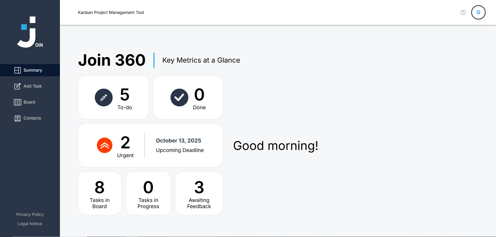

# 🧩 Join – Collaborative Kanban Board

A team-based Kanban board application built as part of a group project at the **Developer Akademie**.  
The goal was to design a functional task management tool with **HTML, CSS, and JavaScript**.

---

## 🚀 Overview

**Join** helps teams organize tasks visually and collaborate efficiently.  
Key features include task management, contacts handling, and drag & drop functionality.

---

## 🛠️ Tech Stack

- HTML5  
- CSS3  
- JavaScript (ES6)  
- Firebase (for user data and storage)  
- LocalStorage (for local session handling)  

---

## 📁 Project Structure
```yaml
join/
├── index.html
├── README.md
├── assets/
│ ├── fonts/
│ └── img/
├── includes/
├── overlays/
│ └── contacts/
├── pages/
├── scripts/
│ ├── add_task/
│ └── contacts/
├── styles/
│ └── contacts/
├── screenshots/
├── templates/
└── firebase/

```
Code kopieren

---

## 🔑 Firebase Setup

Since the original Firebase project was owned by Evgenij, create your **own Firebase project**:

1. Go to [Firebase Console](https://console.firebase.google.com/)  
2. Create a new project (e.g., `join-martin`)  
3. Add a web app and copy your Firebase config  
4. Create `firebase/firebaseConfig.js`:

```javascript
const firebaseConfig = {
  apiKey: "YOUR_API_KEY",
  authDomain: "YOUR_PROJECT.firebaseapp.com",
  projectId: "YOUR_PROJECT",
  storageBucket: "YOUR_PROJECT.appspot.com",
  messagingSenderId: "YOUR_SENDER_ID",
  appId: "YOUR_APP_ID"
};

firebase.initializeApp(firebaseConfig);
Import this config in your scripts where needed.

👨‍💻 Team & Responsibilities
Name	Role	Focus Area
Martin Freimuth	Developer	Contacts module, UI integration, Firebase setup, documentation
Evgenij Liske	Developer	Task and board logic
Anne Sanewski	Developer	Sign-in and user handling

### 🖼️ Screenshots

**Kanban Board**  


**Task Board**  


**Contacts Module (by Martin Freimuth)**  

Images are responsive and scale down on smaller screens.

⚙️ Setup Instructions
Clone the repository:

bash
Code kopieren
git clone https://github.com/Martin-Frei/join.git
Open index.html in your browser

Replace Firebase credentials with your own (see Firebase section)

Enjoy your own version of Join

💡 Key Features
Drag & drop task organization

User login with Firebase

Contact management module (Martin's work)

Responsive design for all screen sizes

Modular JavaScript code structure

🧠 Future Improvements
Backend integration with Django or Node.js

Real-time database sync

Dark mode and theme customization

Authentication with tokens

📬 Contact
Martin Freimuth
📍 Rosenheim, Bavaria, Germany
📧 mat.frei@gmx.de
🔗 LinkedIn
🔗 GitHub